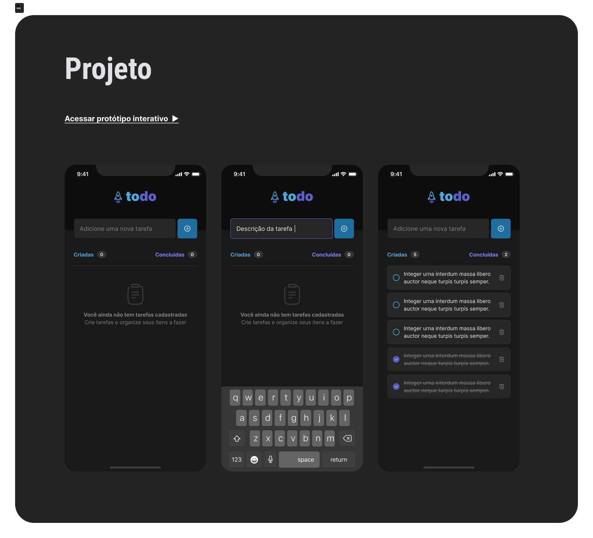

# Todo List



## About

Project develop in course Ignite React Native´s (chapter 01) challange.

In this project I could use the follow tecnologies:

 - React Native (useState, useContext, useCallback, useMemo)
 - TypeScript
 - Expo
 - StyleSheet (for customization purposes)

The main challange for me, was work in the components and make them equal from the prototype in Figma.

## Installation


Install the dependencies and devDependencies and start the server.

```sh
cd todoList
npx install
npx expo start

```

## License

MIT
